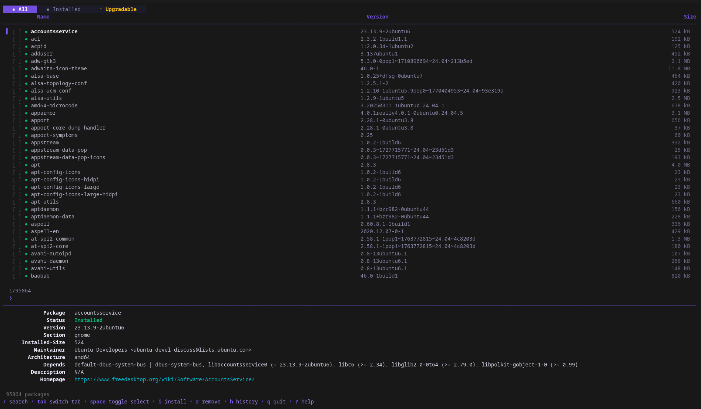

# GPM

GPM is a terminal user interface (TUI) written in Go for managing APT packages. Browse, search, install, remove and upgrade packages — all without leaving the terminal.

Built with [Bubble Tea](https://github.com/charmbracelet/bubbletea), [Lip Gloss](https://github.com/charmbracelet/lipgloss) and [Bubbles](https://github.com/charmbracelet/bubbles).



## Features

- **Browse all packages** — lists every available APT package with version and size info loaded lazily
- **Fuzzy search** — live fuzzy filtering as you type, with fallback to `apt-cache search`
- **Tabs** — switch between *All*, *Installed* and *Upgradable* views
- **Multi-select** — mark multiple packages with `space`, then bulk install/remove/upgrade
- **Parallel downloads** — installs and upgrades use parallel downloads by default for faster operations
- **Transaction history** — every operation is recorded; undo (`z`) or redo (`x`) past transactions
- **Fetch mirrors** — detect your distro, test mirror latency, and apply the fastest sources
- **Inline detail panel** — shows package metadata (version, size, dependencies, homepage, etc.)

## Installation

```bash
go install github.com/mexirica/gpm/cmd@latest
```

Or build from source:

```bash
git clone https://github.com/mexirica/gpm.git
cd gpm
go build -o gpm ./cmd
sudo mv gpm /usr/local/bin/
```

## Usage

```bash
gpm
```

> Some operations (install, remove, upgrade, apply mirrors) require `sudo`.

## Keybindings

### Navigation

| Key | Action |
|---|---|
| `↑` / `k` | Move up |
| `↓` / `j` | Move down |
| `pgup` / `ctrl+u` | Page up |
| `pgdown` / `ctrl+d` | Page down |
| `tab` | Switch tab (All → Installed → Upgradable) |

### Search

| Key | Action |
|---|---|
| `/` | Open search bar |
| `enter` | Confirm search |
| `esc` | Clear search / go back |

### Selection

| Key | Action |
|---|---|
| `space` | Toggle select current package |
| `A` | Select / deselect all filtered packages |

### Actions

| Key | Action |
|---|---|
| `i` | Install package (or all selected) |
| `r` | Remove package (or all selected) |
| `u` | Upgrade package (or all selected) |
| `G` | Upgrade all packages (`apt-get upgrade`) |
| `ctrl+r` | Refresh package list |

### History & Mirrors

| Key | Action |
|---|---|
| `h` | Open transaction history |
| `z` | Undo selected transaction |
| `x` | Redo selected transaction |
| `f` | Fetch and test mirrors |

### General

| Key | Action |
|---|---|
| `?` | Toggle full help |
| `q` / `ctrl+c` | Quit |

## License

MIT — see the `LICENSE` file for details.