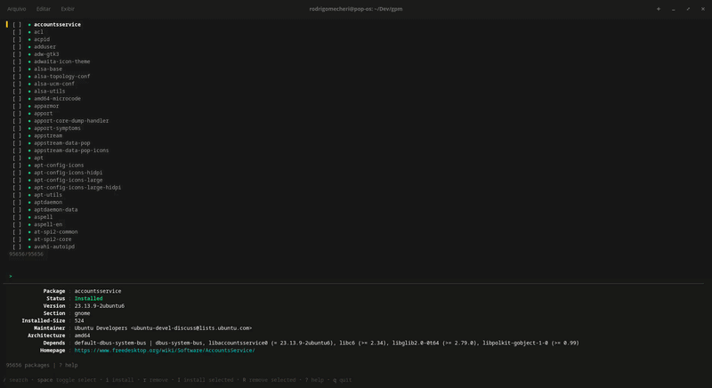

# GPM

GPM is a terminal user interface (TUI) written in Go to browse, install, remove and upgrade APT packages. It uses Bubble Tea, Lip Gloss and Bubbles for a responsive terminal UI.

## Usage & Keybindings

Primary keys you'll use inside the app:

- `/` : start search
- `space` : toggle select current package
- `A` : select/unselect all filtered packages
- `i` : install current package
- `r` : remove current package
- `u` : upgrade current package
- `I` : install selected packages (bulk)
- `R` : remove selected packages (bulk)
- `U` : upgrade selected packages (bulk)
- `G` : upgrade all packages (apt upgrade)
- `enter` : show actions / details
- `esc` : back / clear search
- `?` : toggle help
- `q` : quit

Notes:
- Use `space` to mark multiple packages, then press `I`, `R` or `U` to run bulk operations.
- The UI shows a compact footer with the search box, package details and help.

## License

MIT — see the `LICENSE` file for details.