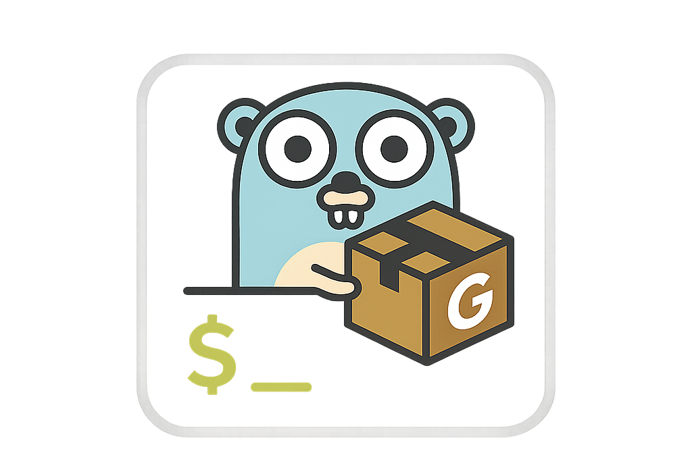
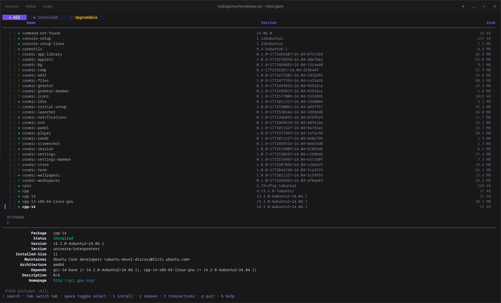
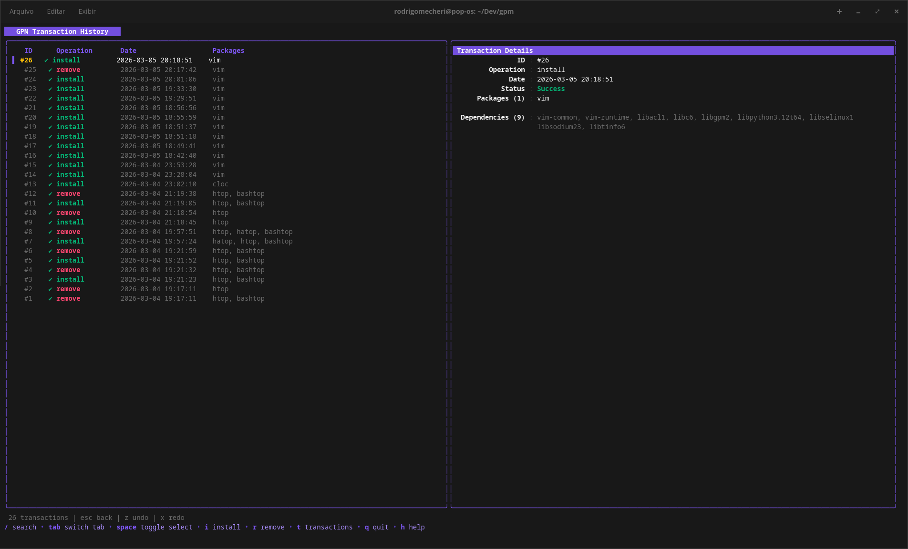
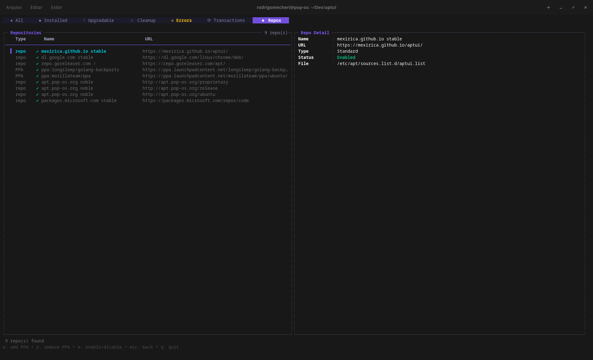
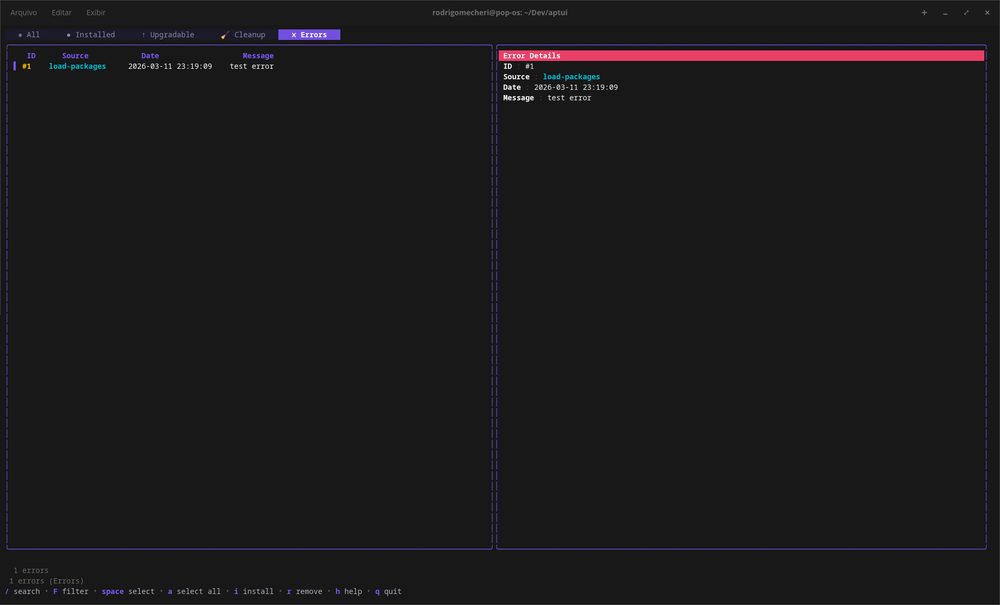
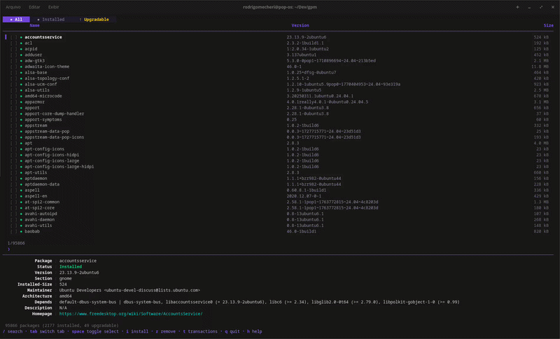

<p align= "center">  </p>

APTUI is a terminal user interface (TUI) written in Go for managing APT packages. Browse, search, install, remove and upgrade packages — all without leaving the terminal.

Built with [Bubble Tea](https://github.com/charmbracelet/bubbletea), [Lip Gloss](https://github.com/charmbracelet/lipgloss) and [Bubbles](https://github.com/charmbracelet/bubbles).


<table>
<tr>
  <td></td>
  <td></td>
</tr>
<tr>
  <td></td>
  <td></td>
</tr>
</table>




## Features

- **Browse all packages** — lists every available APT package with version and size info loaded lazily
- **Search & filter** — single bar for fuzzy search and structured filters (section, architecture, size, status and more) ([docs](docs/filter.md))
- **Column sorting** — sort packages by name, version, size, section or architecture; click headers to cycle ascending → descending → clear
- **Tabs** — switch between *All*, *Installed*, *Upgradable*, *Cleanup*, *Errors*, *Transactions* and *Repos* views; tabs with pending items highlight in yellow
- **Multi-select** — mark multiple packages with `space`, then bulk install/remove/upgrade
- **Mouse support** — click to select packages, click again to toggle selection, click column headers to sort, scroll wheel to navigate
- **Parallel downloads** — installs and upgrades use parallel downloads by default for faster operations
- **Transaction history** — every operation is recorded; undo (`z`) or redo (`x`) past transactions ([docs](docs/history.md))
- **Fetch mirrors** — detect your distro, test mirror latency, and apply the fastest sources ([docs](docs/mirrors.md))
- **PPA management** — list, add, remove, enable and disable PPA repositories ([docs](docs/ppa.md))
- **Cleanup** — dedicated tab listing autoremovable packages; clean them all with `c`
- **Error log** — all errors are captured and shown in a dedicated tab with source, timestamp and full message detail
- **Light / Dark theme** — auto-detects terminal background; override with `APTUI_THEME=light|dark` or toggle at runtime with `T`
- **Pin favorites** — pin packages with `F` to keep them at the top of the list (★); pins are persisted across sessions
- **Export / Import** — export all (`E`) or only manually installed (`M`) packages to JSON; import from file (`I`) to restore your environment ([docs](docs/portpkg.md))
- **Hold packages** — hold (`H`) packages to prevent them from being upgraded
- **File list** — view installed files for any package (`l`); uses `apt-file` for non-installed packages
- **Inline detail panel** — shows package metadata (version, size, dependencies, homepage, status, etc.); scroll with `J`/`K` when content overflows
- **Side-by-side & stacked layouts** — toggle between layouts with `L`; auto-selects based on terminal width (≥ 120 for side-by-side)
- **Essential package protection** — essential packages cannot be removed or purged
- **Background updates** — silent `apt-get update` runs in the background after initial load

## Installation

### APT (Debian/Ubuntu)

```bash
curl -fsSL https://mexirica.github.io/aptui/public-key.gpg | sudo gpg --dearmor -o /usr/share/keyrings/aptui-archive-keyring.gpg
echo "deb [signed-by=/usr/share/keyrings/aptui-archive-keyring.gpg] https://mexirica.github.io/aptui/ stable main" | sudo tee /etc/apt/sources.list.d/aptui.list
sudo apt update && sudo apt install aptui
```

### Termux (Android)

```bash
pkg install golang
go install github.com/mexirica/aptui@latest
```

On Termux, `sudo` is not available and not needed — APTUI detects the Termux environment automatically and runs all commands without `sudo`. APT paths are resolved via the `$PREFIX` environment variable.

### Go

```bash
go install github.com/mexirica/aptui@latest
```

### Build from source

```bash
git clone https://github.com/mexirica/aptui.git
cd aptui
go build -o aptui .
sudo mv aptui /usr/local/bin/
```

## Usage

```bash
# Run with sudo to allow package management operations (install, remove, upgrade)
sudo aptui
```

On **Termux**, run without `sudo`:

```bash
aptui
```

## Tabs

| Tab | Icon | Description |
|---|---|---|
| All | `◉` | All known packages (installed + available) |
| Installed | `●` | Only installed packages |
| Upgradable | `↑` | Packages with available upgrades |
| Cleanup | `◇` | Autoremovable packages |
| Errors | `✕` | Error log entries |
| Transactions | `⟳` | Transaction history |
| Repos | `◆` | PPA / repository management |

Navigate tabs with `tab` / `shift+tab`, or click on them.

## Package Indicators

| Symbol | Meaning |
|---|---|
| `●` (green) | Installed |
| `○` (gray) | Not installed |
| `↑` (yellow) | Upgradable |
| `↑` (red) | Security update available |
| `⊝` (orange) | Held |
| `★` | Pinned |
| `◈` | Essential |
| `ᴹ` | Manually installed |
| `[x]` / `[ ]` | Selected / unselected |

## Keybindings

### Navigation

| Key | Action |
|---|---|
| `↑` / `k` | Move up |
| `↓` / `j` | Move down |
| `J` | Scroll detail panel down |
| `K` | Scroll detail panel up |
| `pgup` / `ctrl+u` | Page up |
| `pgdown` / `ctrl+d` | Page down |
| `tab` | Next tab |
| `shift+tab` | Previous tab |

### Search & Filter

| Key | Action |
|---|---|
| `/` | Open [search/filter](docs/filter.md) bar |
| `enter` | Confirm search / apply filter |
| `esc` | Clear search / filter / go back |

#### Examples

```
vim                          # fuzzy search for "vim"
section:editors vim          # filter by section + fuzzy search combined
installed size>10MB          # installed packages larger than 10 MB
section:utils order:name     # packages in "utils" section, sorted A→Z
order:size:desc              # all packages sorted by size, largest first
```

See the full [search & filter documentation](docs/filter.md) for all available options.

### Selection

| Key | Action |
|---|---|
| `space` | Toggle select current package |
| `a` | Select / deselect all filtered packages |
| `click` | Select a package (click again to toggle check) |

### Sorting

| Key / Mouse | Action |
|---|---|
| Click column header | Sort by that column (click again to reverse, third click to clear) |
| `/` + `order:name` | Sort by name via query |
| `/` + `order:size:desc` | Sort by size descending via query |

### Actions

| Key | Action |
|---|---|
| `i` | Install package (or all selected) |
| `r` | Remove package (or all selected) — shows confirmation dialog |
| `u` | Upgrade package (or all selected) |
| `G` | Upgrade all packages (`apt-get dist-upgrade`) |
| `p` | Purge package (or all selected) — shows confirmation dialog |
| `H` | Hold / unhold package (or all selected) |
| `c` | Clean up all autoremovable packages |
| `F` | Pin / unpin package (or all selected) |
| `E` | Export all installed packages to JSON file |
| `M` | Export only manually installed packages to JSON file |
| `I` | Import packages from JSON file |
| `U` | Run `apt-get update` |
| `ctrl+r` | Refresh package list |

### History & Mirrors

| Key | Action |
|---|---|
| `t` | Open transaction history |
| `z` | Undo selected transaction |
| `x` | Redo selected transaction |
| `f` | Fetch and test mirrors |

See: [Transaction History](docs/history.md) · [Mirror Fetch](docs/mirrors.md)

### PPA Management

| Key | Action |
|---|---|
| `P` | Open PPA list |
| `a` | Add a new PPA |
| `r` | Remove selected PPA |
| `e` | Enable / disable selected PPA |
| `esc` | Back to package list |

See: [PPA Management](docs/ppa.md)

### File List

| Key | Action |
|---|---|
| `l` | Show / hide file list for selected package |
| `Shift+↓` / `J` | Scroll file list down |
| `Shift+↑` / `K` | Scroll file list up |
| `Shift+PgDn` | Page down in file list |
| `Shift+PgUp` | Page up in file list |

### General

| Key | Action |
|---|---|
| `L` | Toggle side-by-side / stacked layout |
| `T` | Toggle light / dark theme |
| `R` | Toggle install recommends (default: ON) |
| `S` | Toggle install suggests (default: OFF) |
| `D` | Clear error log (on Errors tab) |
| `h` | Toggle full help |
| `q` / `ctrl+c` | Quit |

### Confirmation Dialogs

Remove and purge actions show a confirmation dialog:

| Key | Action |
|---|---|
| `y` | Confirm |
| `n` / `esc` | Cancel |
| `←` / `→` / `tab` | Switch between Cancel and Confirm buttons |
| `enter` | Execute focused button |

Import confirmation:

| Key | Action |
|---|---|
| `y` | Confirm and install |
| `n` / `esc` | Cancel |
| `d` | Toggle detail view (paginated package list) |
| `←` / `→` | Navigate detail pages |

## Data Storage

APTUI stores its data in `~/.local/share/aptui/` (resolves the real user's home even under `sudo`):

| File | Contents |
|---|---|
| `~/.local/share/aptui/history.json` | Transaction history |
| `~/.local/share/aptui/pins.json` | Pinned packages |
| `~/.local/share/aptui/errors.json` | Error log |
| `~/aptui-packages.json` | Exported package list |

## Theme

APTUI auto-detects whether your terminal has a light or dark background using the standard OSC 11 query. Some terminals (e.g. Cosmic Terminal) don't respond to this query, so APTUI may default to dark mode even on a light background.

You can override detection in two ways:

**Environment variable** — set `APTUI_THEME` before launching:

```bash
# Force light mode (use -E with sudo to preserve the variable)
APTUI_THEME=light sudo -E aptui

# Force dark mode
APTUI_THEME=dark sudo -E aptui

# Or export it in your shell profile
export APTUI_THEME=light
```

**Runtime toggle** — press `T` at any time to switch between light and dark mode. Once toggled, auto-detection is disabled for the rest of the session.

## Documentation

- [Search & Filter](docs/filter.md) — full query syntax, field filters, boolean filters, size comparisons, sorting
- [PPA Management](docs/ppa.md) — adding, removing, enabling and disabling PPAs
- [Transaction History](docs/history.md) — how operations are recorded, undo/redo rules
- [Mirror Fetch](docs/mirrors.md) — supported distros, how mirrors are tested and applied
- [Export & Import](docs/portpkg.md) — exporting and importing package lists

---

<a href="https://www.star-history.com/?repos=mexirica%2Faptui&type=date&legend=top-left">
 <picture>
   <source media="(prefers-color-scheme: dark)" srcset="https://api.star-history.com/image?repos=mexirica/aptui&type=date&theme=dark&legend=top-left" />
   <source media="(prefers-color-scheme: light)" srcset="https://api.star-history.com/image?repos=mexirica/aptui&type=date&legend=top-left" />
   
 </picture>
</a>
